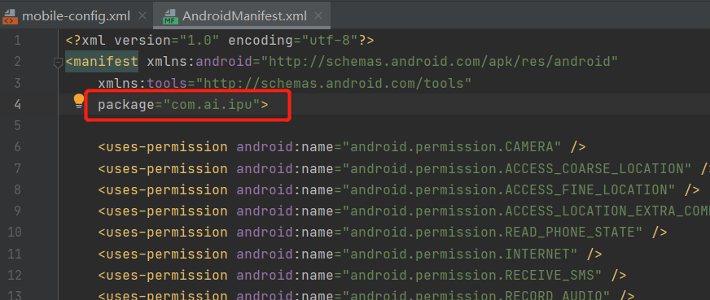
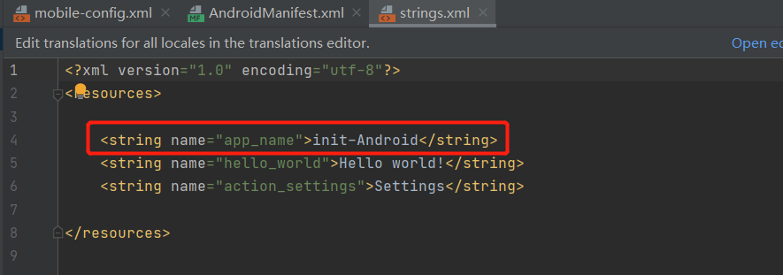
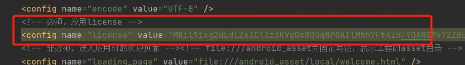

# 获取License

## 30天License

访问[IPU License网站](http://www.aiipu.com/license-server/mobile?sessionId=null)上申请临时License，30天有效。一般用于开发；

1. 使用NT账号和NT密码登录；

2. 填写`应用名`、`应用唯一标识`、选择`平台类型`，点击`获取 License`；

   > 此处应用唯一标识与通过脚手架获取客户端工程时输入的包名一致；

   

3. 参考本文中的`配置License`章节，将`应用名`，`应用唯一标识`，`License`更新到客户端工程中；

   

## 三年License

用于生产环境，通常在生产上线之前进行申请。

1. 下载[亚信艾扑应用申请表](http://www.aiipu.com:8090/source/亚信艾扑应用申请表.xlsx)。

2. 填写表格，以邮件的形式提交给**黄波** （huangbo@asiainfo.com）,发送邮件时请抄送给各相关领导。发送邮件时除了提供申请表之外，还请同时提供如下项目相关材料：

   - 请提供3-5张APP截图；
   - APP的需求、设计文档或者客户使用手册等文档资料；

3. 审核通过后，以邮件的方式发放License。

4. 参考本文中的`配置License`章节，将`应用名`，`应用唯一标识`，`License`更新到客户端工程中；

   **<font color='red'>IPU目前提供的license的有效期是3年，临近到期时，请提前再次申请。</font>**


# 配置License

## 替换Android License

1. 打开`AndroidManifest.xml`文件，检查文件中的`package`是否与申请的`应用唯一标识`一致，不一致则修改`AndroidManifest.xml`文件。

   

2. 打开`strings.xml`文件，检查文件中的`app_name`是否与申请的`应用名`一致，不一致则修改`strings.xml`文件。

   

3. 打开`mobile-config.xml`配置文件，将获取到的License配置到name等于license的config记录中。

   
   
   

### 替换iOS License

1. 获取本项目的应用名。 

   

2. 获取本项目的应用唯一标识。 

   

3. 打开`mobile-config.xml`配置文件，将获取到的License配置到name等于license的config记录中。

   ```xml
   <config name="license" value="你的许可证" ></config>
   ```

   


<link rel="stylesheet" href="https://cdn.jsdelivr.net/npm/gitalk@1/dist/gitalk.css">
<script src="../source/md5.min.js"></script>
<script src="https://cdn.jsdelivr.net/npm/gitalk@1/dist/gitalk.min.js"></script>
<div id="gitalk-container"></div>
<script>
  var gitalk = new Gitalk({
    "clientID": "f8eec1cd59e53d8158d2",
    "clientSecret": "83873640a1aa569a87ab8d07b210efe35b6797b8",
    "repo": "IPU-DOCUMENT",
    "owner": "luckywangyj",
    "admin": ["luckywangyj"],
    "id": md5(location.href),    
    "distractionFreeMode": false  
  });
  gitalk.render("gitalk-container");
</script>


