# 搭建开发环境

欢迎使用 IPU！这篇文档会帮助你搭建基本的 IPU 开发环境。

根据你所使用的操作系统、针对的目标平台不同，具体步骤有所不同。如果想同时开发 iOS 和 Android 也没问题，你只需要先选一个平台开始，另一个平台的环境搭建只是稍有不同。

IPU开发框架划分为3个解耦的框架：服务端框架、Android客户端框架、iOS客户端框架；iOS和Android共用一套服务端。

## 服务端

### 推荐安装的工具

#### IntelliJ IDEA

进入[官网](https://www.jetbrains.com/idea/)，选择【Download】,点击进入，选择操作系统，下载相应的版本，默认安装即可；


### 初始化服务端

可通过[脚手架](http://www.aiipu.com/scaffold)获取服务端工程；点击“IPU Server”，选择SpringBoot纯净版工程，输入`工程名`，`包名`，`应用名`，`访问根路径`，点击`生成工程`，下载保存demo.zip；

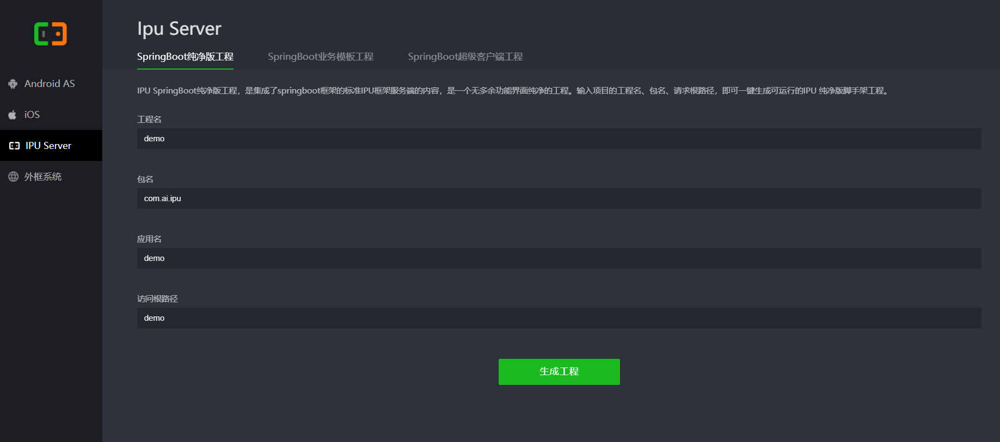

> 访问根路径前，请不要加/

 

### 导入服务端

解压demo.zip并导入IntelliJ IDEA开发工具中，`File` -> `Open` ->  选择解压了的demo文件夹。


### 编译服务端

1. 按照本站提供的`IPU私服的使用`，使用IPU私服，并在IntelliJ IDEA开发工具中配置Maven，`File` -> `Settings` -> `Maven` 。

   > 具体的路径可能和下图不一致，请自行确认。

   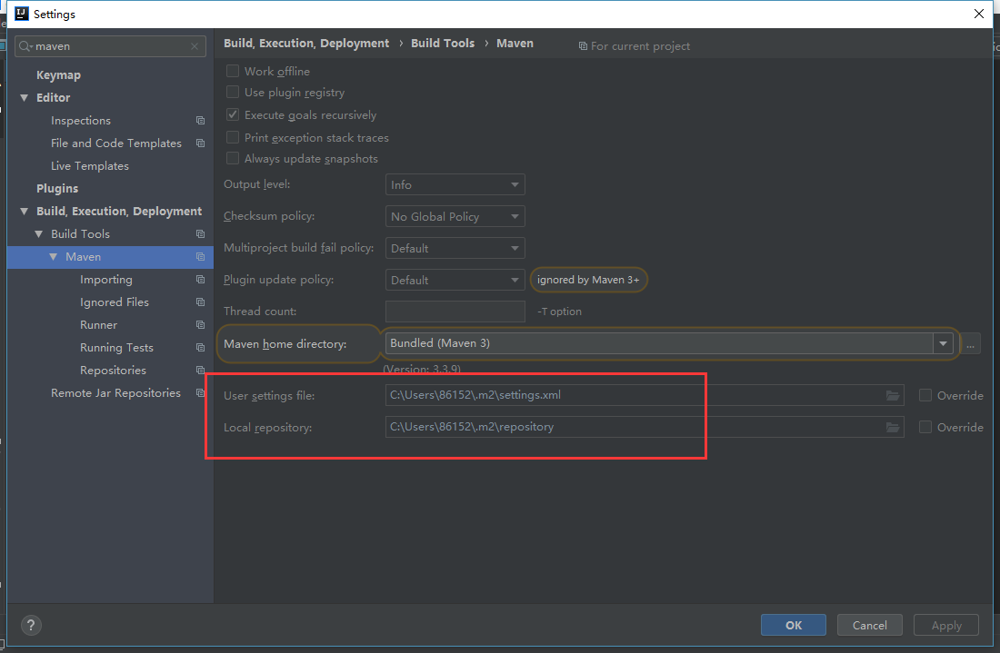

2. 编译项目，在IntelliJ IDEA开发工具中打开命令窗口视图，`View` -> `Tool Windows` ->  `Terminal	`，执行命令`mvn clean package`。                     

   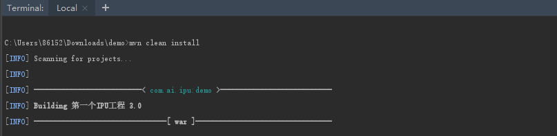                                                                                                                                                                                                                                                                                                                                                                                                                                                                                                                                                                                                                                                                                                                                                                                                                                                                                                                                                                                                                                                                                                                                                                                                                    


### 部署服务端

1. 下拉`IpuServerDemoStart`选项，单击`Edit Configurations... `选项；

   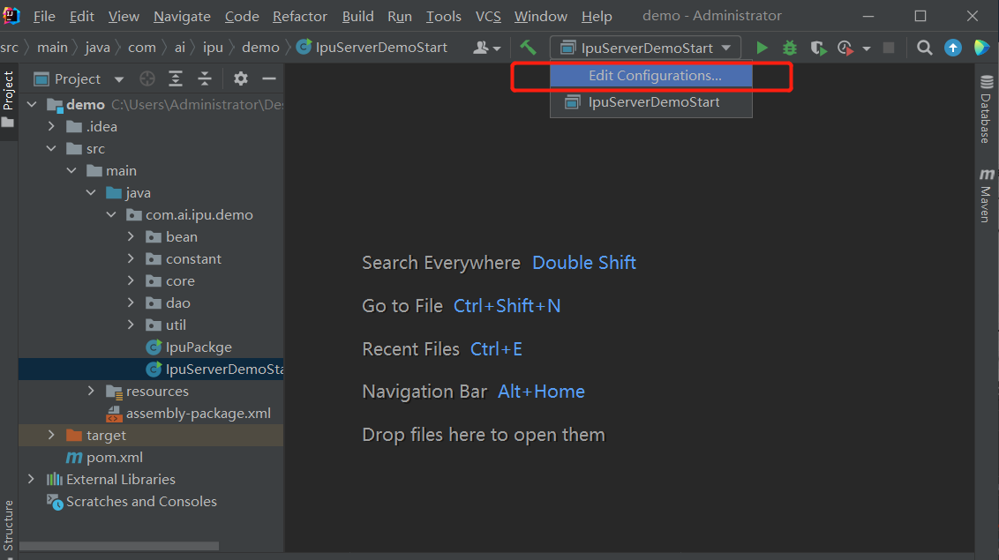

2. 弹出 ` Run/Debug Configurations` 对话框，在 `Build and run` 中输入```--server.port=8080``` （其中8080 是服务启动占用的端口号 ），最后单击 `OK` 按钮；

   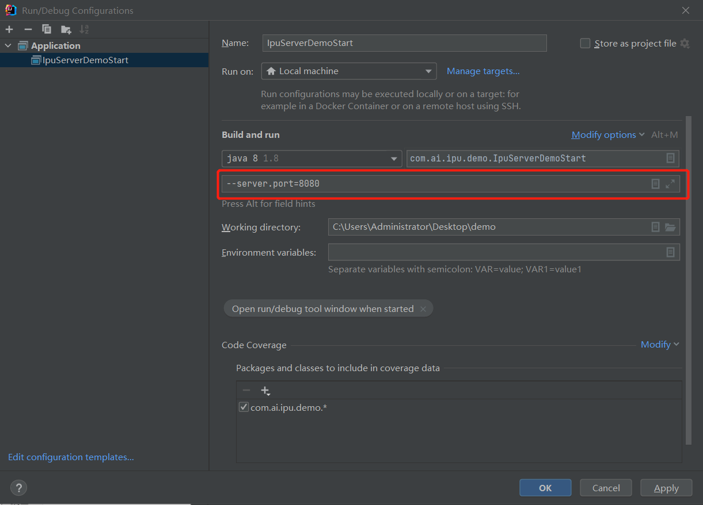

3. 右击demo项目的启动类`IpuServerDemoStart`，在右击菜单项中单击`Debug'IpuServerDemoStart...main()'`或者 `Run'IpuServerDemoStart...main()'`  选项，即可完成本地的安装部署启动。

   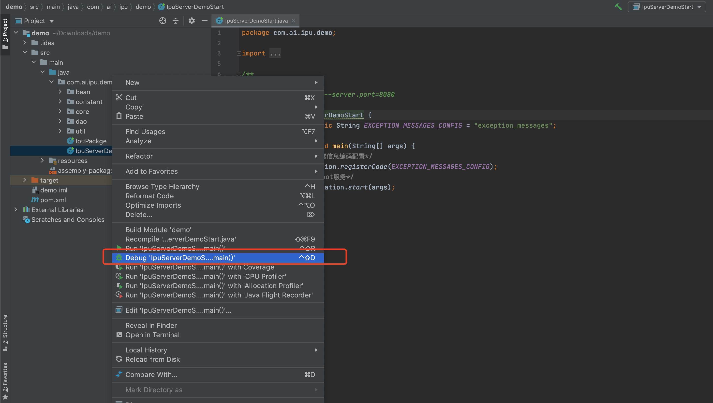


### 运行

1. 点击IntelliJ IDEA开发工具中右上角的`Run`、`Debug`按钮。

   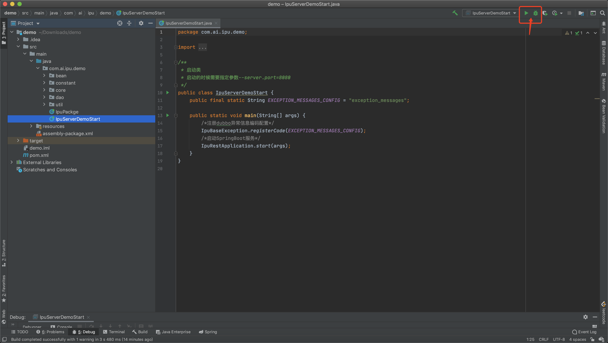

2. 在浏览器窗口中，输入`http://localhost:8080/demo/mobile` 看到首页，则说明你已成功运行了项目。其中demo是您在脚手架中申请的`访问根路径`一致；

   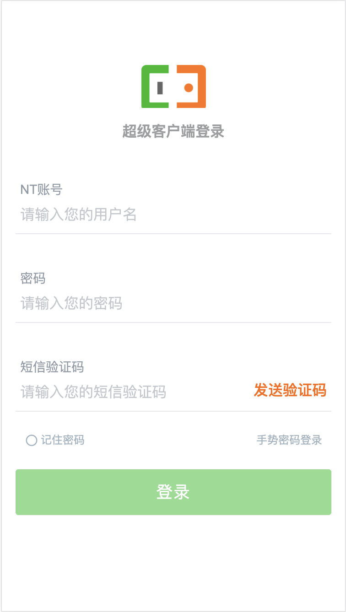


### 修改项目

现在你已经成功运行了项目，我们可以开始尝试动手改一改了：

1. 打开`login.html`，随便写上几行代码，保存修改；

   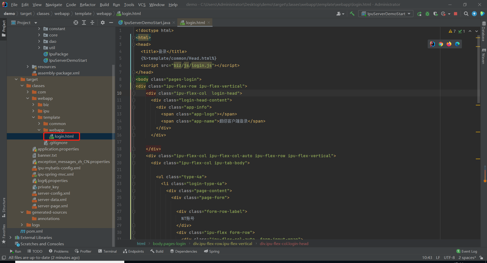

2. 刷新浏览器页面就可以看到你的最新修改；

3. 停止服务，重新在命令窗口视图执行`mvn clean package`命令，编译项目，以便在后续的客户端工程中访问到最新的服务端修改。

   > 重新编译是为了更新服务端资源版本，使得客户端第二次访问的时候增量更新服务端资源文件；


### 服务端项目发布

## 部署步骤

1. 申请临时license，在网站申请30天的license文件，其中应用名填写工程打包的jar包的主文件名:ngboss-server，申请地址：
http://www.aiipu.com/license-server/mobile
2. 对工程做maven打包，生成jar包
3. 把jar包、工程中的shell目录、还有license文件，都上传到服务器中
4. 修改shell目录中的子目录的目录名，目录名即端口号，可以放多个，多个则会启动多个实例
5. 修改shell目录中的springboot.cfg文件中的内容，把jar包路径和license路径根据服务器上传的文件存放路径进行修改
6. 执行sh start_all.sh即是启动服务，执行 sh stop_all.sh即是停止服务

项目开发完成，需要将服务打包上传部署至主机环境：

1. 停止服务，重新在命令窗口视图执行`mvn clean package`命令，编译项目。编译完成后，可在target目录下找到对应的jar，如`demo.jar`， 将jar包上传至主机服务器；

2. 通过[license服务平台](http://www.aiipu.com/license-server/mobile?sessionId=null)申请服务端License，将申请到的如：` demo.lic` License文件上传至主机服务器；

   


## Android（目标平台：Android，开发平台：Windows）

### 必须的软件

#### Android Studio

目前需要[Android Studio](https://developer.android.google.cn/studio/)2.0 或更高版本。

Android Studio 需要 Java Development Kit [JDK] 1.8（暂不支持更高版本）。你可以在命令行中输入
`javac -version`来查看你当前安装的 JDK 版本。如果版本不合要求，则可以到[官网](http://www.oracle.com/technetwork/java/javase/downloads/jdk8-downloads-2133151.html)上下载。

> 除非特别注明，请不要改动安装过程中的选项。

确定所有安装都勾选了，尤其是`Android SDK`和`Android Device Emulator`。


#### ANDROID_HOME 环境变量

确保`ANDROID_HOME`环境变量正确地指向了你安装的 Android SDK 的路径。

打开`控制面板` -> `系统和安全` -> `系统` -> `高级系统设置` ->`高级` -> `环境变量` -> `新建`

> **具体的路径可能和下图不一致，请自行确认。**

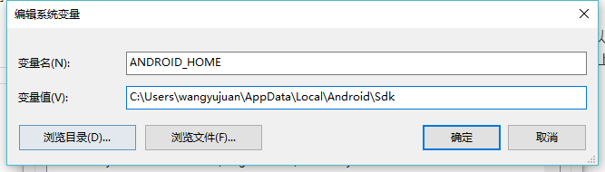

> **你需要关闭现有的命令符提示窗口然后重新打开，这样新的环境变量才能生效。**


### 推荐安装的工具

#### Gradle Daemon

开启[Gradle Daemon](https://docs.gradle.org/2.9/userguide/gradle_daemon.html)可以极大地提升 java 代码的增量编译速度。

```shell
(if not exist "%USERPROFILE%/.gradle" mkdir "%USERPROFILE%/.gradle") && (echo org.gradle.daemon=true >> "%USERPROFILE%/.gradle/gradle.properties")
```

#### 将 Android SDK 的 Tools 目录添加到`PATH`变量中

你可以把 Android SDK 的 tools 和 platform-tools 目录添加到`PATH`变量中，以便在终端中运行一些 Android 工具，例如`android avd`或是`adb logcat`等。

打开`控制面板` -> `系统和安全` -> `系统` -> `高级系统设置` -> `高级` -> `环境变量` -> 选中`PATH` -> 双击进行编辑

> **注意你的具体路径可能和下图不同**

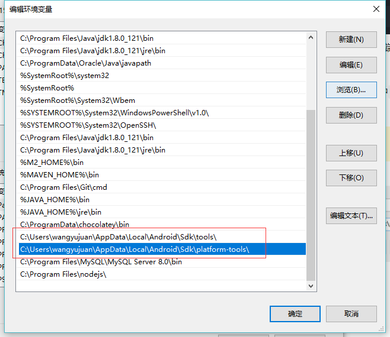

### 可选的安装工具

#### Genymotion

比起 Android Studio 自带的原装模拟器，Genymotion 是一个性能更好的选择，但它只对个人用户免费。

1. 下载和安装[Genymotion](https://www.genymotion.com/download)（genymotion 需要依赖 VirtualBox 虚拟机，下载选项中提供了包含 VirtualBox 和不包含的选项，请按需选择）。
2. 打开 Genymotion。如果你还没有安装 VirtualBox，则此时会提示你安装。
3. 创建一个新模拟器并启动。


### 初始化客户端

可通过[脚手架](http://www.aiipu.com/scaffold)获取客户端工程。输入`工程名`、`包名`、`安卓SDK版本`、`选择插件`，点击`生成工程`，下载保存demoAs.zip。

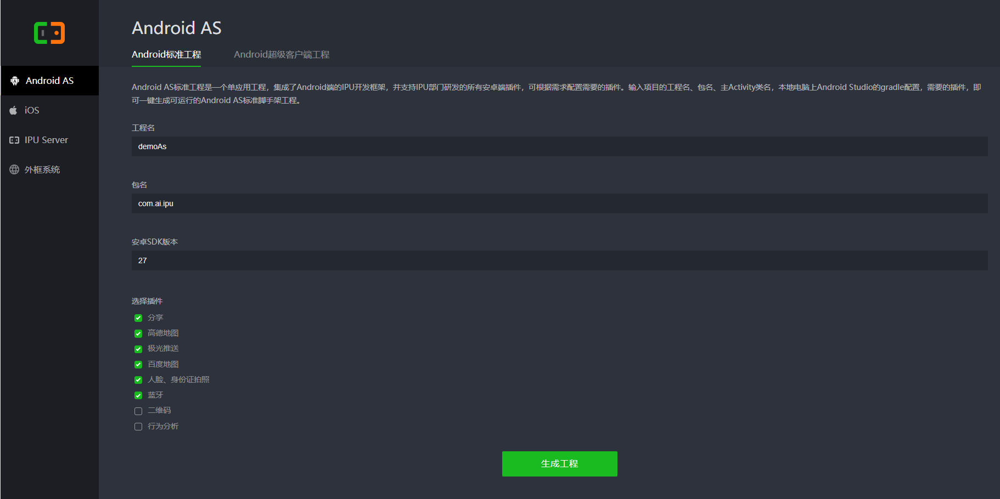


### 导入客户端

解压demoAs.zip并导入Android Studio开发工具中，`File` -> `Open` ->  选择解压了的demoAs文件夹。

1. 选择解压了的demoAs工程目录中的build.gradle；

   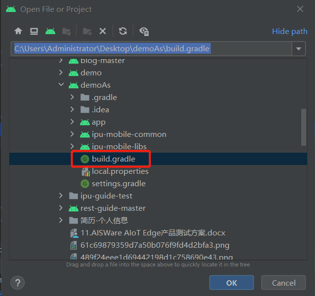

2. 导入后可能会出现gradle sync failed，选择`file`->`settings` -> `build,Execution,Deployment` ->`build`->`gradle` ；

   在gradle user home中填入详细的gradle路径

   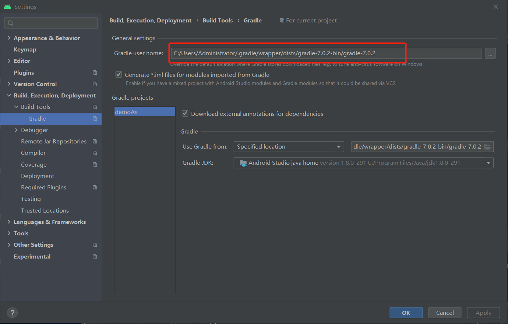

3. 当第一次用Android Studio打开项目时，或者导入别人项目时，常常由于别人使用了和你不同的gradle版本，需要去下载新的[Gradle](https://services.gradle.org/distributions/),建议不要下载版本太高的，后续可能不稳定（推荐下载7.0.2版本）


### 编译

编译项目，点击`Build`-> `Make Project`；

### 运行

1. 修改配置文件`mobile-config.xml`文件，将`request_host`、`request_path`修改成您已成功发布了的服务端；

   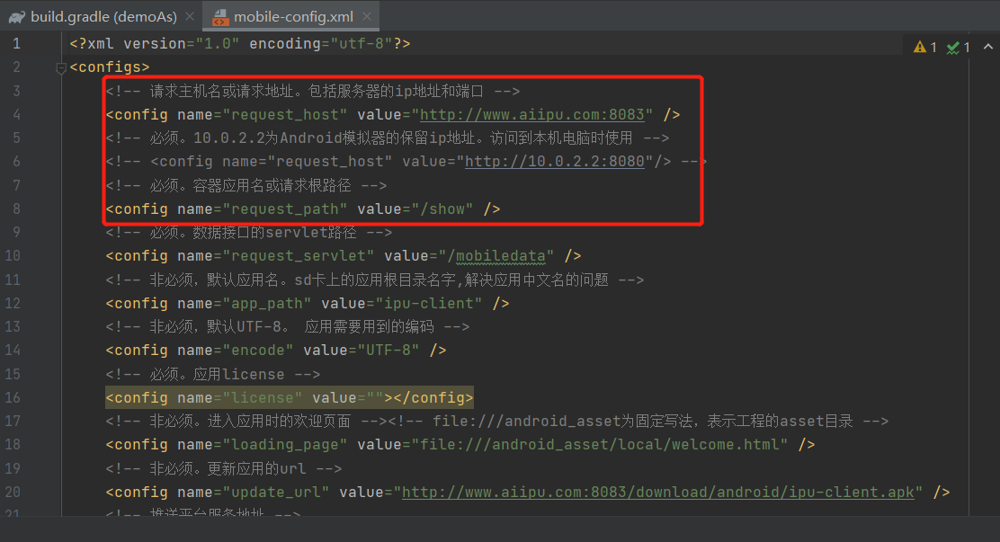

2. 创建一个模拟器，可通过Genymotion创建一个模拟器并启动；或者通过Android studio创建自带原装模拟器；或者用手机USB连接电脑，手机需要打开开发者模式；

   > 这里演示Android studio自带的模拟器

   点击创建一个模拟器

   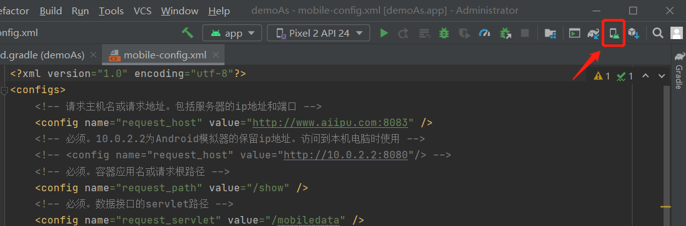

   点击创建

   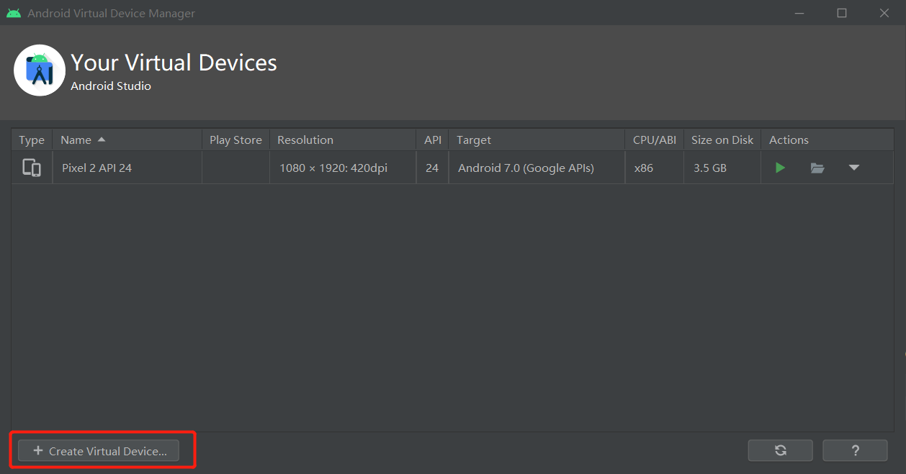

   选择想要的模拟器的样式，点击`next`;

   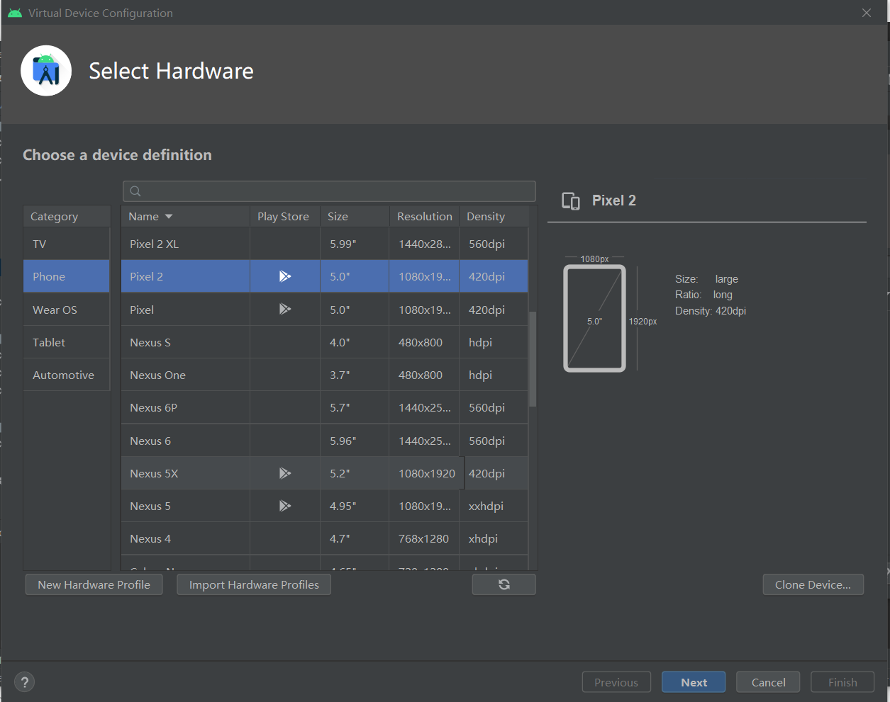

   点击`x86 Images`,选择一个自己需要的点击`Download`下载，然后点击`next`->`finish`完成;

   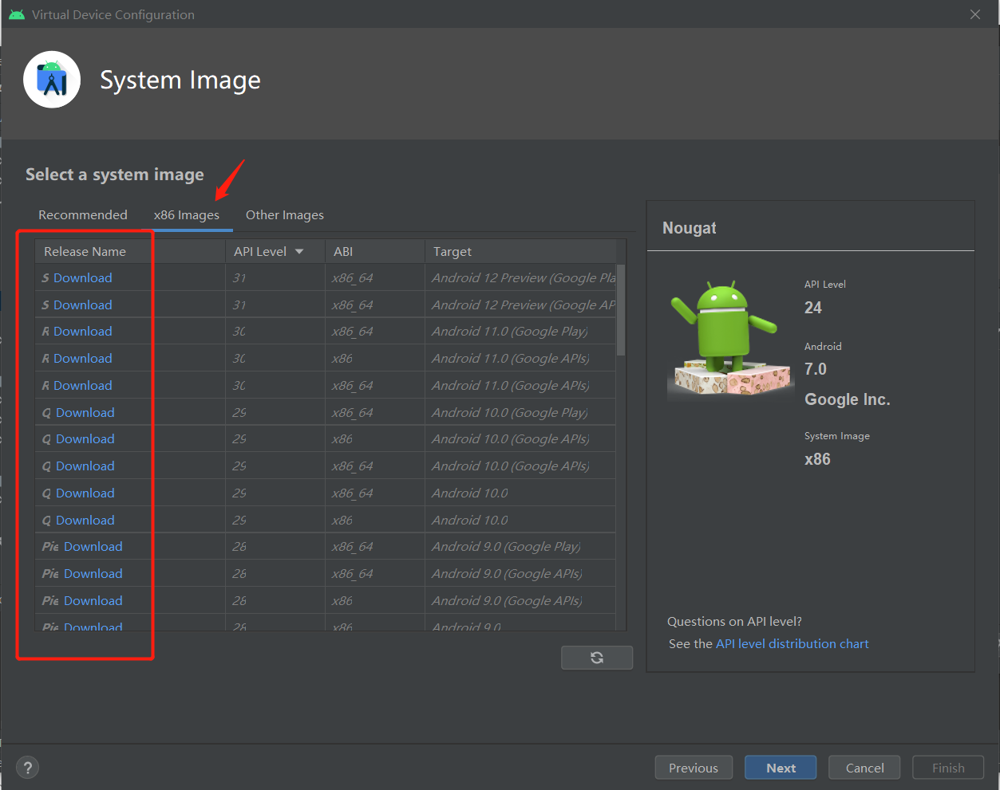

3. 点击运行项目；

   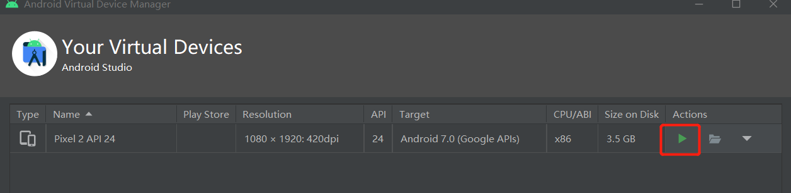

   


### License
IPU框架的使用需要有效的license，试用IPU产品可以通过[license服务平台](http://www.aiipu.com/license-server/mobile?sessionId=null)申请有效期30天的生产license。正式使用则需要找管理员申请有效期3年的生产license，请参考[License](License.md)。无效的License会导致应用的异常；


### 

## iOS（目标平台：iOS，开发平台：macOS）

### 必须的软件

在Mac上的App Store中下载XCode，建议创建Workspace来管理多个工程。


### 初始化客户端

访问[脚手架](http://www.aiipu.com/scaffold)系统，选择iOS标准工程，输入`工程名`，选择所需的插件，点击`生成工程`，下载保存name.zip；

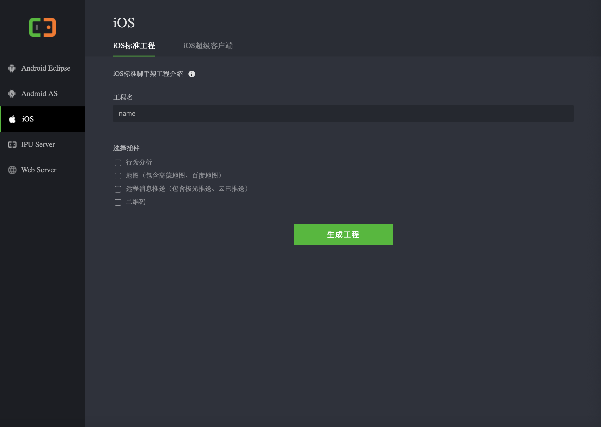

用xcode打开所下载的ipu ios工程，选择模拟器，运行即可；


<link rel="stylesheet" href="https://cdn.jsdelivr.net/npm/gitalk@1/dist/gitalk.css">

<script src="../source/md5.min.js"></script>
<script src="https://cdn.jsdelivr.net/npm/gitalk@1/dist/gitalk.min.js"></script>
<div id="gitalk-container"></div>
<script>
  var gitalk = new Gitalk({
    "clientID": "f8eec1cd59e53d8158d2",
    "clientSecret": "83873640a1aa569a87ab8d07b210efe35b6797b8",
    "repo": "IPU-DOCUMENT",
    "owner": "luckywangyj",
    "admin": ["luckywangyj"],
    "id": md5(location.href),      
    "distractionFreeMode": false  
  });
  gitalk.render("gitalk-container");
</script>


