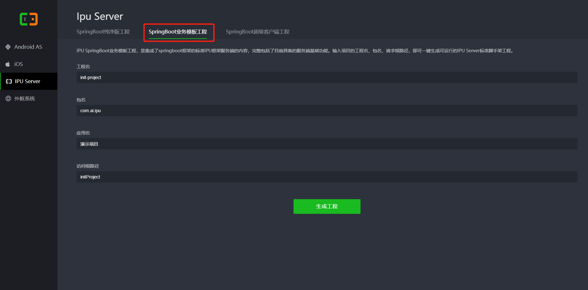
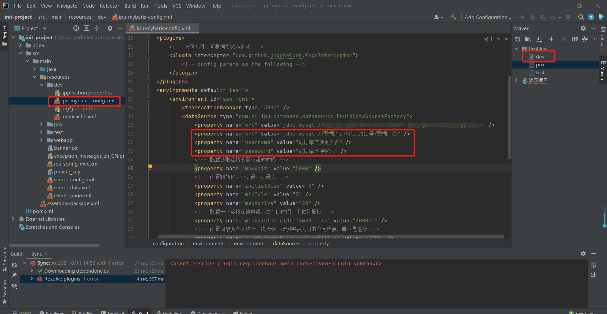
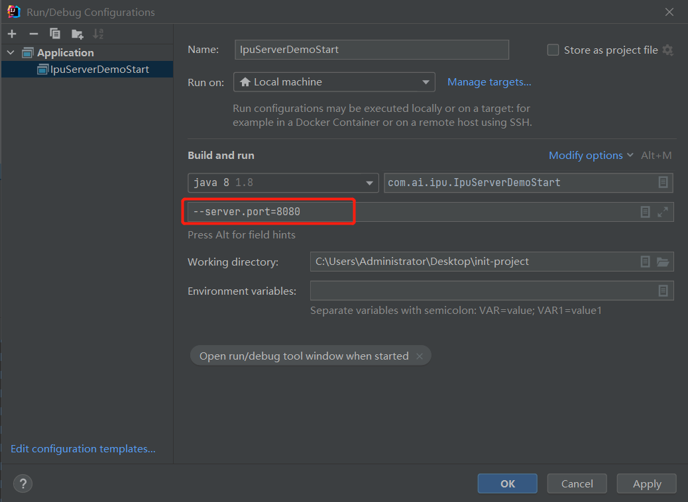
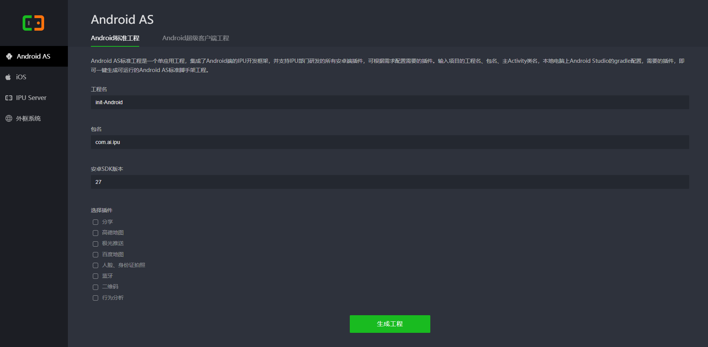
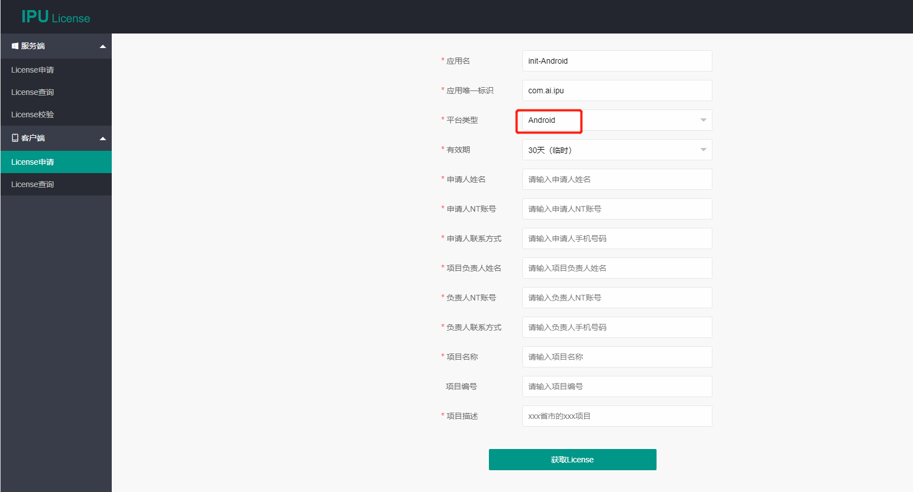
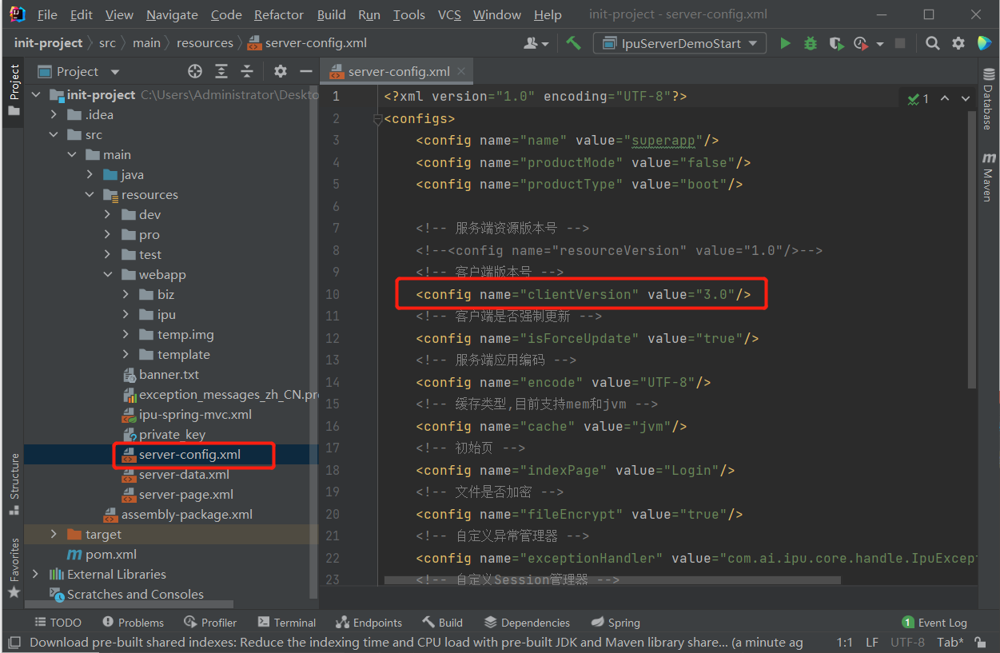
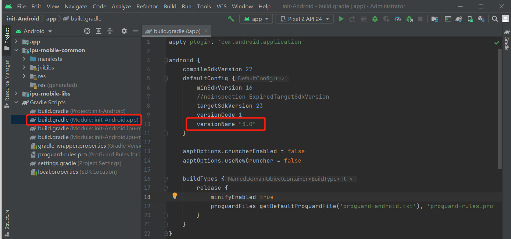
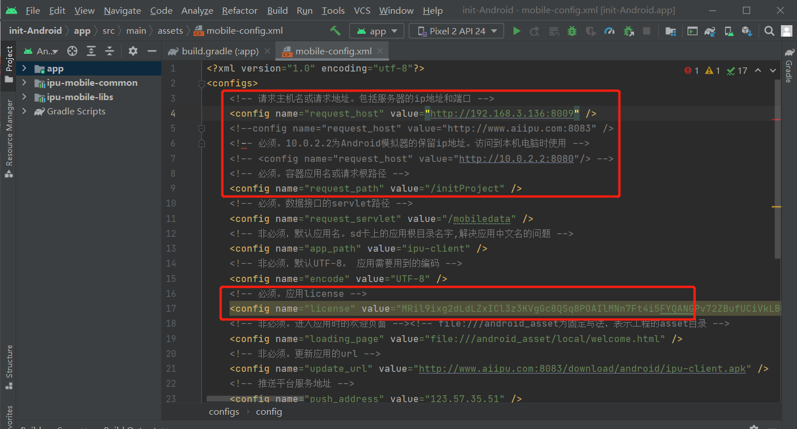

# 通过脚手架开始
欢迎使用 IPU！这篇文档将会帮助你搭建一个 IPU 的示例工程项目。

以下内容主要包括服务端示例工程、和Android客户端框架的下载及运行。

1. 下载服务端示例工程
2. 修改配置并启动服务端工程
4. 下载Android客户端框架
5. 申请license
5. 修改配置启动客户端工程

### 下载服务端示例工程

可通过[脚手架](http://www.aiipu.com/scaffold)获取服务端工程；选择SpringBoot业务模板工程，输入`工程名`，`包名`，`应用名`，`访问根路径`，点击`生成工程`，下载保存init-project.zip；

> SpringBoot纯净版工程，是集成了springboot框架的标准IPU框架服务端的内容，是一个无多余功能界面纯净的工程。输入项目的工程名、包名、请求根路径，即可一键生成可运行的IPU 纯净版脚手架工程。

> SpringBoot业务模板工程，是集成了springboot框架的标准IPU框架服务端的内容，完整包括了目前具备的服务端基础功能。输入项目的工程名、包名、请求根路径，即可一键生成可运行的IPU Server标准脚手架工程。

> SpringBoot超级客户端工程，是一个需要搭配应用管理平台共同使用的服务端工程。从而实现以菜单的形式通过IPU主应用管理三类子应用，即IPU子应用、本地原生应用、第三方Web应用。它集成了IPU服务端框架的内容，是超级客户端的服务端版本。输入项目的工程名，包名，请求根路径，即可一键生成可运行的IPU Server超级客户端脚手架工程。

### 修改配置并启动服务端工程

在常用IntelliJ IDEA开发工具中导入刚下载的init-project工程（详见:搭建开发环境-初始化服务端），使用init-project工程代码中的sql文件，在你本地mysql数据库中导入示例数据库结构及数据，并修改ipu-mybatis-config.xml配置文件。

添加端口，点击`run`或者`debug`启动项目。

成功之后，通过以下url：[http://localhost:8080/initProject/mobile](http://localhost:8080/initProject/mobile)，访问项目

### 下载Android客户端框架

可通过[脚手架](http://www.aiipu.com/scaffold)获取Android客户端工程；输入`工程名`，`包名`，`安卓SDK版本`，点击`生成工程`，下载保存init-Android.zip；

### 申请license

点击进入[License申请页面](http://www.aiipu.com/license-server/mobile?sessionId=null) 用NT账号密码登录后，填写刚才生成的Android客户端的应用名、包名，点击生成license。

> 工程名：对应页面中的应用名，包含整个项目的文件夹名称

> 包名：对应页面中应用的唯一标识，表示工程的路径

### 修改配置启动客户端工程

在Android Studio中导入下载并解压好的init-Android工程（详见:搭建开发环境-初始化客户端），查看启动的服务器工程中的init-project 中配置的客户端版本号，见server-config.xml配置文件中的clientVersion参数，示例工程init-project项目中为3.0

修改Android工程中的版本号，改成和刚查看的服务端配置一致

修改init-Android工程中的mobile-config.xml文件，把ip地址，项目名称，license改成之前启动的服务端工程ip地址，和生成的license。如果你是本地启动的，可以cmd中输入ipconfig查看ipv4地址。

手机和电脑连接同一局域网，点击启动运行Android工程，给手机安装apk并下载服务端工程资源，下载资源成功后，就可以通过手机app查看演示工程了。

