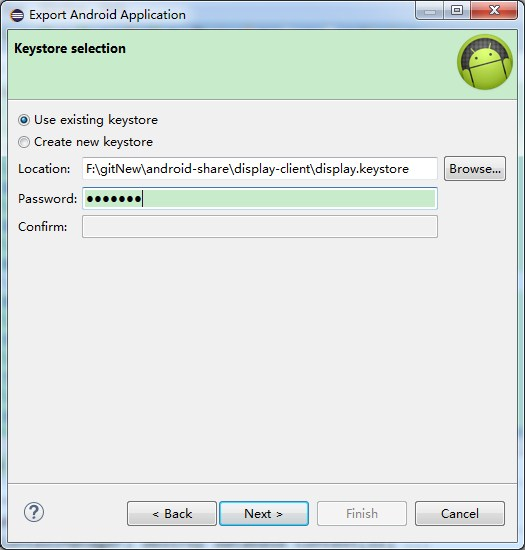
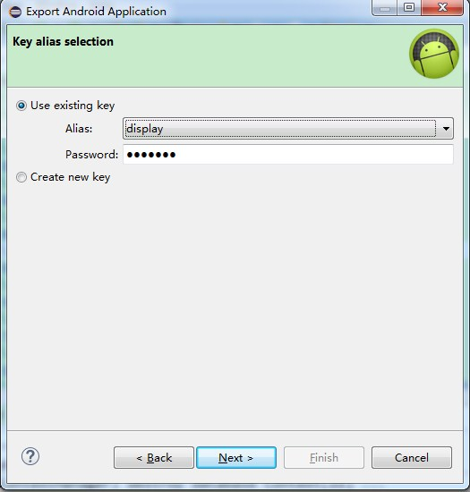
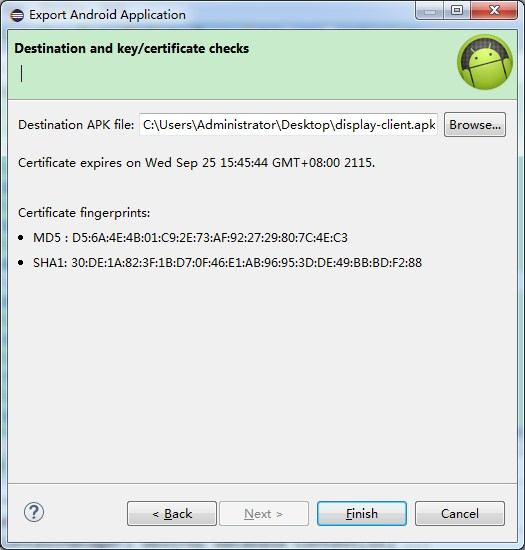
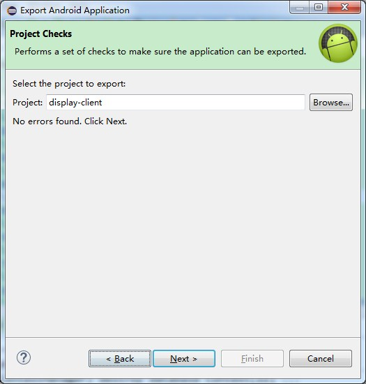

# android应用的升级和签名

> 解释
应用升级：这里的应用升级是指客户端的升级，即apk的升级。
app签名意义：为了保证每个应用程序开发商合法ID，防止部分开放商可能通过使用相同的Package Name来混淆替换已经安装的程序，需要对发布的APK文件进行唯一签名，保证每次发布的版本的一致性(如自动更新不会因为版本不一致而无法安装)。
<b>注：Apk升级模拟器无法测试，需要真机调测。</b>

#一、应用升级
##1.1 前提配置
确保mobile-config.xml的update_url配置的地址是apk的存放地址，可以访问
##1.2 客户端版本号的变更
升级前的客户端版本号：AndroidManifest.xml的versionName值
升级后的客户端版本号：server-config.xml的clientVersion值
确保升级前后的客户端版本号不同
##1.3 apk存放位置
升级后的apk安装包，存放到mobile-config.xml的update_url预定的位置

过程图展示：

#二、apk签名
应用升级后，可能碰到“与已安装应用签名不同”的情况，导致安装失败

原因：使用了eclipse默认的签名，需要使用统一签名打包apk，即可解决
步骤如下：
##2.1 Export Android Application 选择导出的android工程，点击next

##2.2 选择统一签名的keystore
若第一次没有统一keystore，Create new keystore，并设置password，填写必要信息，点击finish生成keystore文件；
若已有keystore文件，选中文件，填写之前设置的password，点击next

##2.3 选中第一次设置的Alias和password，点击next

##2.4 选择生成apk的路径，会显示签名的md5值等信息，点击finish，完毕。

