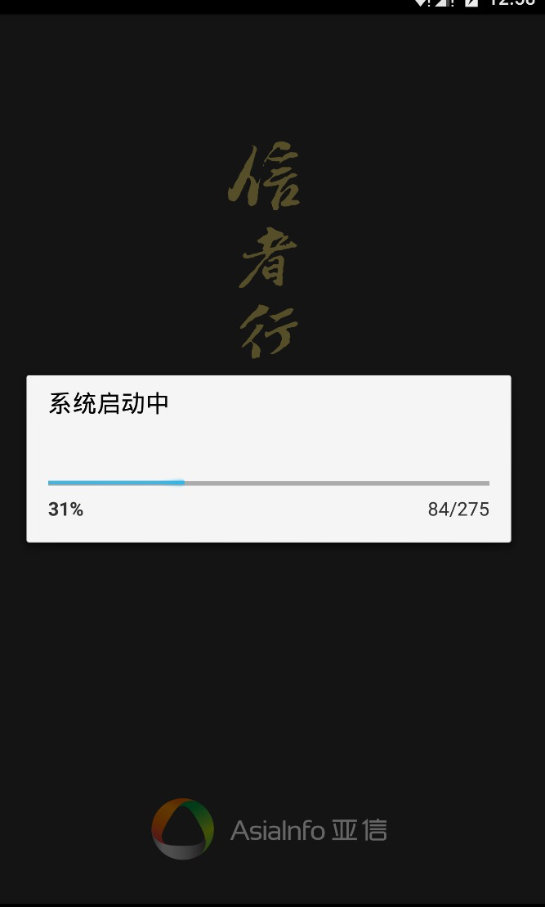
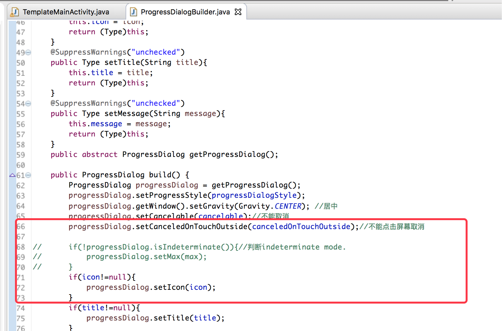
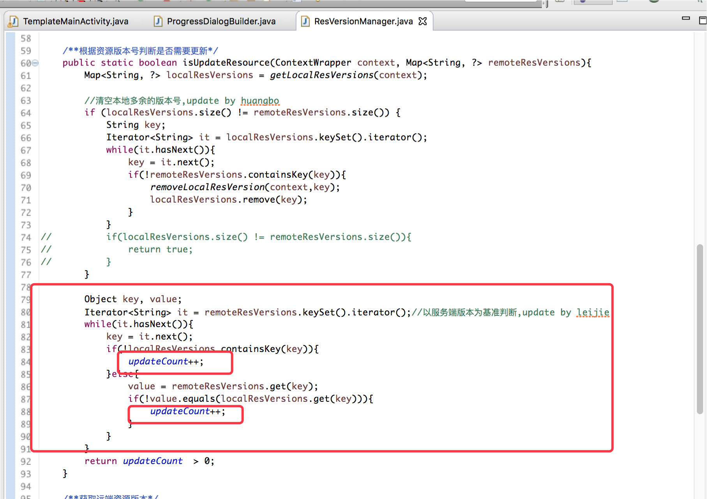
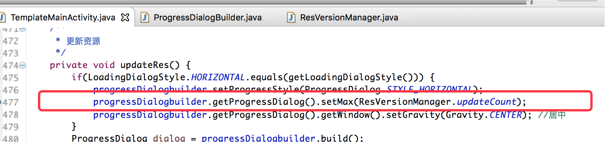

# android自定义更新资源解决方案

# 1，问题场景

依赖网格App框架的App在进行资源更新时，是否需要提示对话框，或者自定义对话框标题，或自定义进度条标题提示的场景；

# 2，解决思路

通过重写TemplateMainActivity中的方法实现自定义，满足不同app的需求；

# 3，解决方案

* 是否展示更新提示对话框：

重写isHintWithUpdateRes()方法，默认为true，需要展示；

```java

/**
* 是否提示更新资源；默认为true
*/
protected  boolean isHintWithUpdateRes() {
    return true;
}
```

* 自定义更新对话框标题及提示：

重写getHintTitleWithUpdateRes()  或 getHintInfoWithUpdateRes()方法；

```java
/**
* 更新提示标题；
*/
protected String getHintTitleWithUpdateRes() {
    return "资源更新";
}


/**
* 更新提示信息;
*/
protected String getHintInfoWithUpdateRes(){
    return "远端发现新资源，是否更新";
}

```

* 自定义进度条标题：

重写getProgressTitleUpdateRes()方法；

```java

/**
* 更新进度标题
*/
protected String getProgressTitleUpdateRes(){
    return Messages.RES_INIT;
}

```


# 4，示例

```java

@Override
protected boolean isHintWithUpdateRes() {
// TODO Auto-generated method stub
return false;
}


@Override
protected String getProgressTitleUpdateRes() {
// TODO Auto-generated method stub
return "系统启动中";

}

```




# 5,其他问题：

* 进度条更新数据来源变更：
以前是固定最大值为100，在checkResource方法中计算所有文件的更新百分比后来实现进度条更新；

现在在确定是否更新中，计算需要更新下载的文件总数，再在checkResouce中计算已下载的文件数，分别传给进度条实现更新；

--删除ProgressDialogBuilder中的代码：



--计算需要更新下载的文件总数，并赋值给进度条的最大值max：



--计算已下载的文件数，更新进度条：



