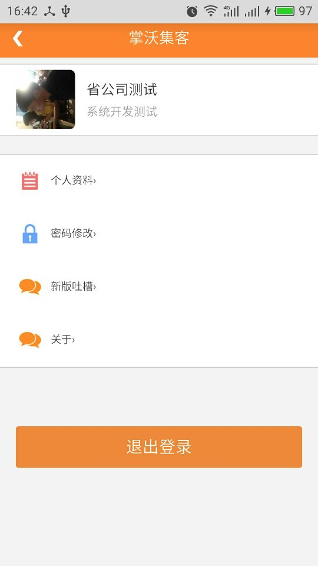
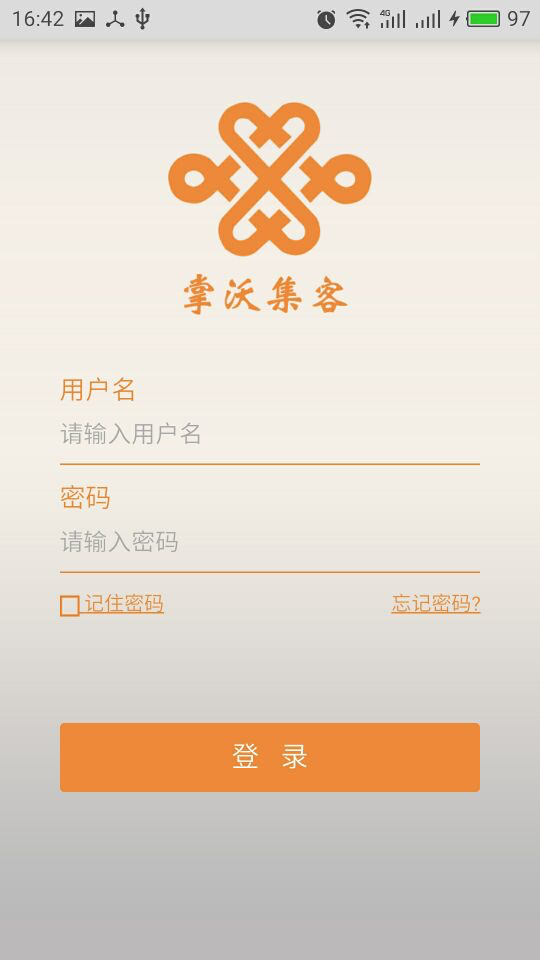

# 退出登录后返回键导致返回上一界面

# 1，问题场景：
在依赖目前网格通App-v2.1框架版本中，有同事反馈说 当从app退出登录进入登录界面后，再点击手机返回键，会进入上一个界面中；正常场景应该是退出app，而不是返回上一个界面；

   
   
   

# 2,解决思路：
通过判断当前界面是否为app初始界面或者为返回即退出的界面，分别执行返回或退出动作，重写onBackPressed（）方法；
# 3，解决方案：

在此给出的一个建议解决方案是：集成TemplateMainActivity时，重写返回键的方法onBackPressed( )：

案列：

```java
try {			
	FlipperLayout flipperLayout = getFlipperLayout();
	if(null != flipperLayout){
		//指定server-config中配置的初始页为退出界面,或者新建一个标签（isExitPage）来存放退出动作
		String indexPage = ServerConfig.getInstance().getValue("indexPage");
		View curView = flipperLayout.getCurrView();

	if(flipperLayout.isCanBack() && null != curView && !indexPage.equals(curView.getTag().toString())){
			flipperLayout.back();
			return;
		}else {			  
		  getWadeMobileClient().shutdownByConfirm(Messages.CONFIRM_CLOSE);
		}
	}
} catch (Exception e) {
	getWadeMobileClient().shutdownByConfirm(Messages.CONFIRM_CLOSE);
}

```

#4,改进：

之后会优化代码来解决；

